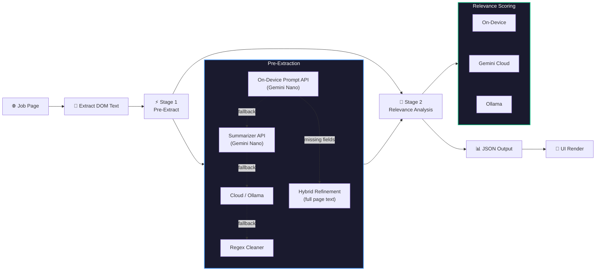

<p align="center">
  
</p>

#  Job Post Highlights 🔍 🎯 📊

LLM-based Chrome extension that evaluates job postings against your resume using AI — extract key details, score relevance, and surface skill gaps in seconds using on-device and cloud LLMs.

[](https://developer.chrome.com/docs/extensions/mv3/)
[](#)
[](docs/setup.md#gemini-cloud-api)
[](docs/setup.md#️-keyboard-shortcut)
[](#-license)

<!-- 
<p align="center">
  
  
</p>
-->

---

## ✨ Features

- **Multi-Provider AI** — Google Gemini (Cloud), Ollama (Local), or Chrome's On-Device Gemini Nano
- **2-Stage Pipeline** — Stage 1 extracts structured job details; Stage 2 scores relevance against your resume
- **Hybrid Extraction** — Detects missing fields after Stage 1 and runs a targeted refinement pass for accuracy
- **Pre-Warmed Model** — On-device Gemini Nano session initialized at startup; subsequent evals use `clone()` for fast execution
- **Privacy First** — API keys and resume data stay in your browser (`chrome.storage.local`)
- **Premium UI** — Glassmorphism design, dark/light themes, side panel + pop-out window modes, timing breakdown
- **Keyboard Shortcut** — `Cmd+J` (Mac) / `Ctrl+J` (Windows) to open instantly
- **Relevance Scoring** — 0–5 scale with match/gap analysis, leveling notes, and unique insights

---

## 🚀 Quick Start

```bash
git clone https://github.com/hellosaumil/JobPostHighlightsExtension.git
```

1. Open `chrome://extensions/` → Enable **Developer mode**
2. Click **Load unpacked** → Select the cloned folder
3. Pin the extension for quick access
4. Open Settings (⚙️) → Choose your AI provider and configure
5. Navigate to any job posting → Click **Evaluate Relevance**

> See [Setup Guide](docs/setup.md) for detailed provider configuration.

---

## 🏗️ Architecture

The extension uses a **2-stage AI pipeline** to minimize token usage and maximize accuracy:



> See [Architecture Guide](docs/architecture.md) for the full pipeline breakdown, scoring rubric, and output schema.

---

## 📁 Project Structure

```
JobPostHighlightsExtension/
├── manifest.json           # Chrome MV3 extension manifest
├── ai_service.js           # 2-stage AI pipeline, session mgmt, hybrid refinement
├── content.js              # DOM text extraction (content script)
├── background.js           # Service worker, side panel toggle, Ollama CORS bypass
│
├── prompts/
│   ├── stage_1.md          # Stage 1 extraction prompt (fields, rules, examples)
│   └── stage_2.md          # Stage 2 scoring rubric template
│
├── sidepanel.html/js       # Side panel UI + controller
├── window.html/js          # Pop-out window UI + controller (tab selector)
├── styles.css              # Shared styles (dark/light themes, glassmorphism)
│
├── assets/                 # Extension icons (16/48/128px + SVG)
└── docs/                   # Detailed documentation
    ├── setup.md            # Installation & provider config
    ├── ollama.md           # Ollama troubleshooting & CORS
    └── architecture.md     # Pipeline deep-dive & output schema
```

---

## 📚 Docs

| Document | Description |
|----------|-------------|
| [Setup Guide](docs/setup.md) | Installation, provider configuration, On-Device AI setup |
| [Ollama Guide](docs/ollama.md) | CORS troubleshooting, environment variables, recommended models |
| [Architecture](docs/architecture.md) | 2-stage pipeline, scoring rubric, output JSON schema |

---

## 🛠️ Technologies

- **Platform**: Chrome Extension (Manifest V3)
- **AI Providers**: Gemini Cloud API, Ollama (Local), Chrome Built-in AI (Gemini Nano)
- **Frontend**: Vanilla HTML / CSS / JavaScript (no frameworks)
- **Fonts**: [Space Grotesk](https://fonts.google.com/specimen/Space+Grotesk), [JetBrains Mono](https://fonts.google.com/specimen/JetBrains+Mono), [Silkscreen](https://fonts.google.com/specimen/Silkscreen)
- **Design**: Glassmorphism, CSS custom properties, responsive layouts

---

## Acknowledgements

Thanks to [](https://antigravity.google) [](https://deepmind.google/technologies/gemini/) and [](https://www.anthropic.com/claude) for co-building this extension.

---

## 📄 License

MIT License — see [LICENSE](LICENSE) for details.
