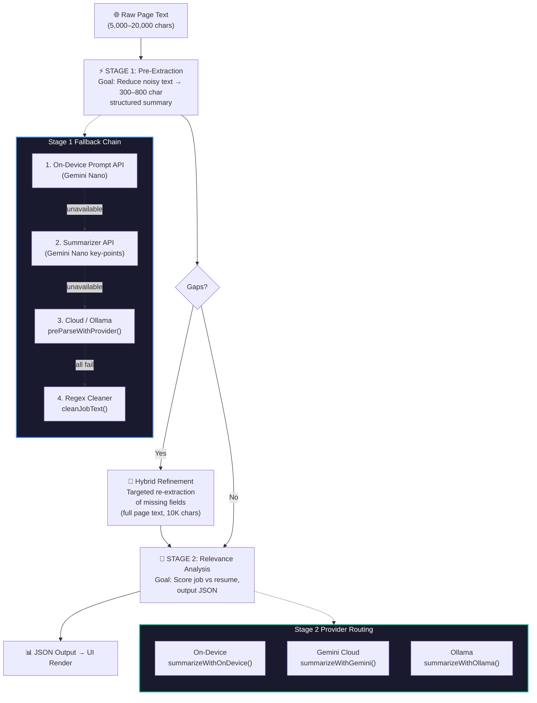
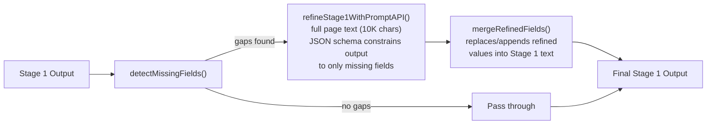
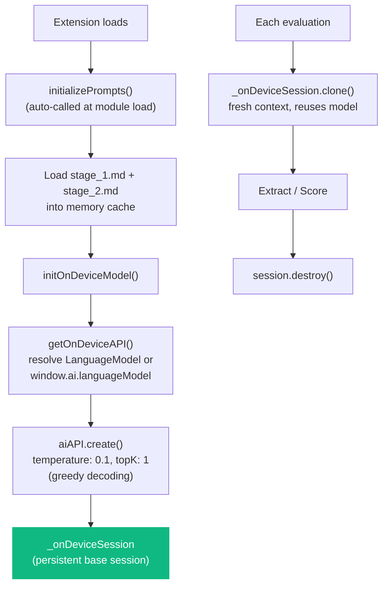

# Architecture Guide

## Overview

Job Post Highlights uses a **2-stage AI pipeline** designed to minimize token usage and cost while maximizing scoring accuracy.



---

## Stage 1: Pre-Extraction

**File:** `ai_service.js` → `preParseJobText()`, `extractWithOnDevice()`, `extractWithSummarizer()`
**Prompt:** `prompts/stage_1.md` (loaded at runtime via `getStage1SystemPrompt()`, cached in memory)

Stage 1 condenses raw job page text into a concise structured format that feeds into Stage 2. This reduces token usage and focuses Stage 2 on relevant signals.

### Extracted Fields

```
TITLE | SALARY | TEAM | LOCATION | EXPERIENCE | ROLE FOCUS
PRIMARY LANGUAGES | REQUIRED SKILLS | PREFERRED SKILLS
KEY RESPONSIBILITIES | ABOUT ROLE
```

### Fallback Chain

| Priority | Method | Function | Trigger |
|----------|--------|----------|---------|
| 1 | **On-Device Prompt API** (Gemini Nano via `ai.languageModel`) | `extractWithOnDevice()` | `onDeviceAPI === 'prompt'` |
| 2 | **Summarizer API** (Gemini Nano key-points) | `extractWithSummarizer()` | `onDeviceAPI === 'summarizer'` (default) |
| 3 | **Selected Provider** (Gemini Cloud / Ollama) | `preParseWithProvider()` | On-device unavailable |
| 4 | **Regex Cleaner** | `cleanJobText()` | All models fail |

### Hybrid Refinement

After initial extraction, missing critical fields (`salary`, `team`, `keyResponsibilities`, `aboutRole`) trigger a second targeted pass using the On-Device Prompt API:



This is called from `summarizeJob()` after the initial Stage 1 extraction completes — it solves salary extraction failures where compensation appears late in the page (past the 4,000-char truncation point).

### On-Device Session Management

The Gemini Nano session is **pre-warmed at startup** to eliminate the ~25s initialization cost from each evaluation:



Both `sidepanel.js` and `window.js` also call `initOnDeviceModel()` on `DOMContentLoaded` (only when provider is `'ondevice'`) to show init status in the UI.

---

## Stage 2: Relevance Analysis

**File:** `ai_service.js` → `summarizeJob()`, `summarizeWithOnDevice()`, `summarizeWithGemini()`, `summarizeWithOllama()`
**Prompt:** `prompts/stage_2.md` (loaded at runtime via `fetchPrompt()`, cached in memory)

Stage 2 applies the full scoring rubric against the Stage 1 output.

### Scoring Rubric (0–5)

| Score Range | Category | Criteria |
|-------------|----------|----------|
| 4.5–5.0 | **Full Match** | Strong alignment, Senior/Mid-Senior title, all hard requirements met |
| 2.0–4.0 | **Semi Match** | Staff+ title (cap 4.0), missing preferred skills (cap 3.5), vague JD (cap 3.5) |
| 0 | **No Match** | Any hard requirement fails |

### Hard Requirements (Score 0 if any apply)

- **Missing Python** — Python is not a primary required language (polyglot OK if Python explicitly listed)
- **Location** — Role is outside the US or not Remote
- **Over-Qualified** — Required experience exceeds 7 years (Bachelor's + 7y = Semi-match at best)
- **Wrong Focus** — Frontend, Mobile, Embedded, Hardware, Firmware, RF/Wireless, Connectivity, or Kernel/Driver roles

### Template Variables

`fetchPrompt()` substitutes two placeholders in `stage_2.md`:
- `{{resumeSource}}` — either `"A PDF of my resume (attached)"` or a hardcoded candidate summary string
- `{{pageText}}` — the truncated Stage 1 output

---

## Output JSON Schema

```json
{
  "title": "string",
  "salary": "string",
  "team": "string",
  "expReq": "string",
  "relevanceScore": 0.0,
  "summary": {
    "primaryStatus": {
      "match": "NO-MATCH | SEMI-MATCH | FULL-MATCH",
      "reason": "string (max 15 words)"
    },
    "levelingNote": "string | NULL",
    "fullMatches": ["Category (Tech in JD & Resume)"],
    "partialMissing": ["Gap (Tech in JD, not in Resume)"],
    "uniqueInsight": "string (max 15 words)"
  }
}
```

---

## File Responsibilities

| File | Responsibility |
|------|---------------|
| `ai_service.js` | All AI logic: Stage 1 & 2 pipeline, session management, hybrid refinement, provider routing |
| `prompts/stage_1.md` | Stage 1 extraction prompt — field definitions, rules, examples |
| `prompts/stage_2.md` | Stage 2 scoring rubric — injected with `{{pageText}}` and `{{resumeSource}}` at runtime |
| `content.js` | Content script — extracts DOM text from the active job tab (selectors + fallback to `body`) |
| `background.js` | Service worker — side panel toggle, pop-out window, Ollama CORS bypass via `declarativeNetRequest` |
| `sidepanel.js` | Side panel UI controller — model init on load, evaluation flow, result rendering |
| `window.js` | Pop-out window controller — adds tab selector for cross-tab analysis |

> **Note:** `js_bridge.js` exists as a Node.js CLI testing utility (not loaded by the extension). It references the now-removed `prompt.md` and is non-functional.

---

## Context Window Management

| Stage | Provider | Constant | Char Limit | Notes |
|-------|----------|----------|------------|-------|
| — | Content script | `PAGE_EXTRACT` | 15,000 | Raw DOM text cap (~3,750 tokens) |
| Stage 1 | On-Device (Gemini Nano) | `STAGE1_NANO` | 4,000 | ~1K tokens |
| Stage 1 | Summarizer API | `STAGE1_SUMMARIZER` | 8,000 | Dynamic via `measureInputUsage()` |
| Stage 1 | Gemini Cloud / Ollama | `STAGE1_CLOUD` | 6,000 | ~1.5K tokens |
| Stage 1 | Hybrid refinement | — | 10,000 | Full page text for missing fields |
| Stage 2 | On-Device | `STAGE2_ON_DEVICE` | 6,000 | ~1.5K tokens |
| Stage 2 | Gemini Cloud | `STAGE2_DEFAULT` | 10,000 | ~2.5K tokens |
| Stage 2 | Ollama | `STAGE2_OLLAMA` | 4,000 | `num_predict: 400` (Stage 1), `800` (Stage 2) |

`smartTruncate()` cuts at the last newline boundary before the limit — never mid-sentence.
