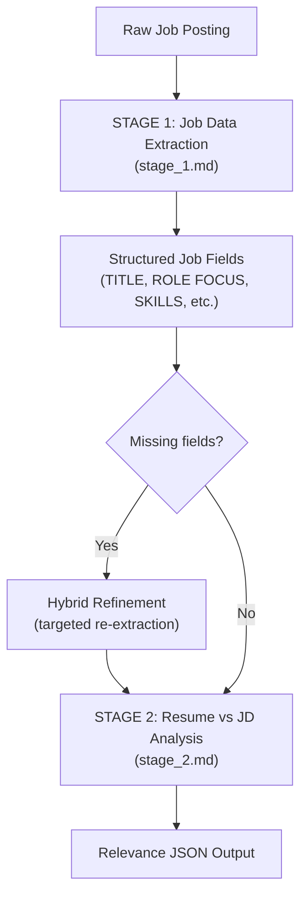

# Prompts

This directory contains the prompts used by the Job Post Highlights extension's two-stage AI analysis pipeline.

## Files

- **`stage_1.md`** — Job posting data extraction prompt
  - Parses raw job posting text into structured fields (TITLE, SALARY, TEAM, LOCATION, EXPERIENCE, ROLE FOCUS, PRIMARY LANGUAGES, REQUIRED SKILLS, PREFERRED SKILLS)
  - Used by `extractWithOnDevice()`, `extractWithSummarizer()`, and `preParseWithProvider()` in ai_service.js
  - Output is a concise, plain-text summary that feeds into Stage 2

- **`stage_2.md`** — Resume vs JD gap analysis prompt
  - Evaluates job posting against candidate resume
  - Applies hard requirements (Python, Location, Over-Qualified, Wrong Focus)
  - Implements scoring rubric (0-5 scale) and skill gap analysis
  - Returns structured JSON output with relevance score and detailed summary
  - Loaded by `fetchPrompt()` in ai_service.js

## Pipeline

## Token Limits

| Stage | Provider | Constant | Char Limit |
|-------|----------|----------|------------|
| Stage 1 | On-Device (Nano) | `STAGE1_NANO` | 4,000 |
| Stage 1 | Summarizer API | `STAGE1_SUMMARIZER` | 8,000 |
| Stage 1 | Cloud / Ollama | `STAGE1_CLOUD` | 6,000 |
| Stage 2 | On-Device | `STAGE2_ON_DEVICE` | 6,000 |
| Stage 2 | Gemini Cloud | `STAGE2_DEFAULT` | 10,000 |
| Stage 2 | Ollama | `STAGE2_OLLAMA` | 4,000 |

See `INPUT_LIMITS` in `ai_service.js` for exact values per provider.

## Refinements

Both prompts are refined for:
- **Clarity**: Explicit rules and examples prevent ambiguity
- **Efficiency**: Minimal token usage, structured output format
- **Accuracy**: Hard requirements checked before leveling/scoring
- **Maintainability**: Separated into logical stages for easier updates
